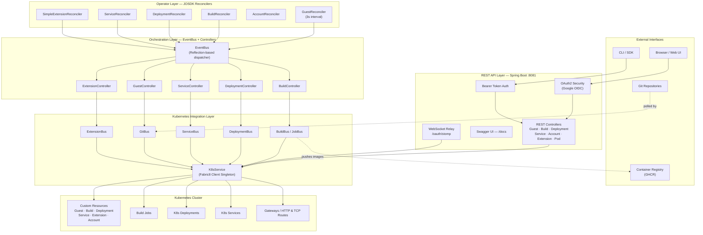
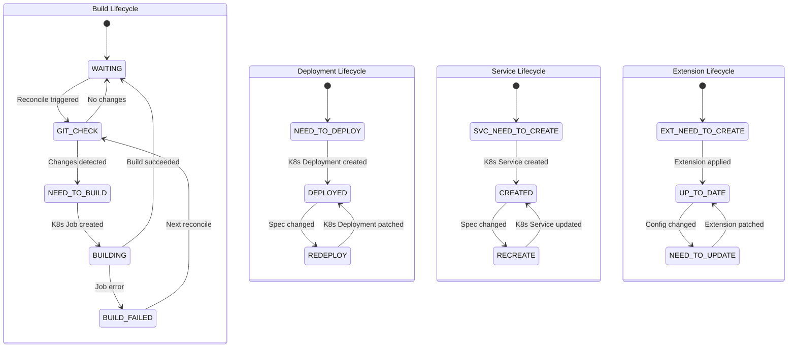
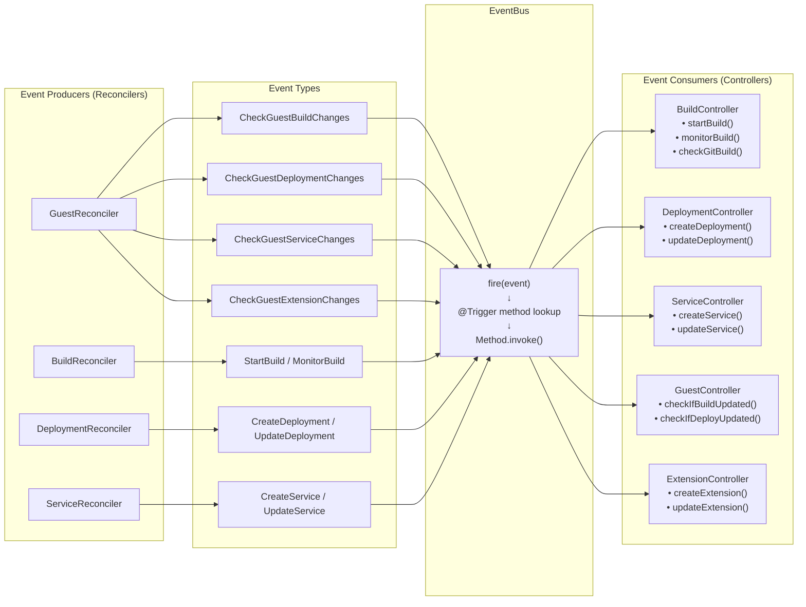
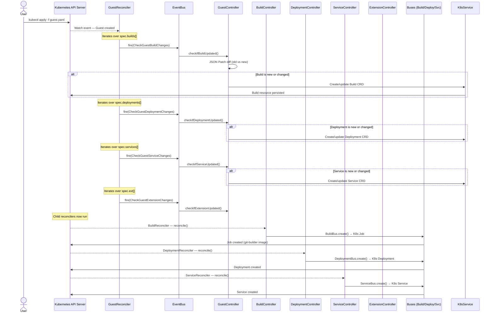
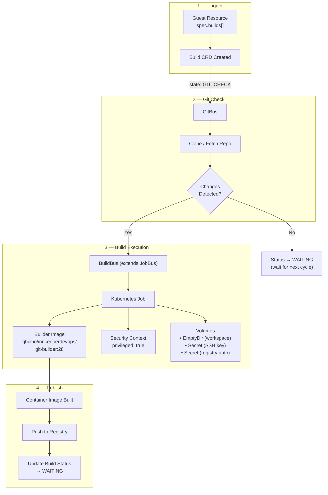
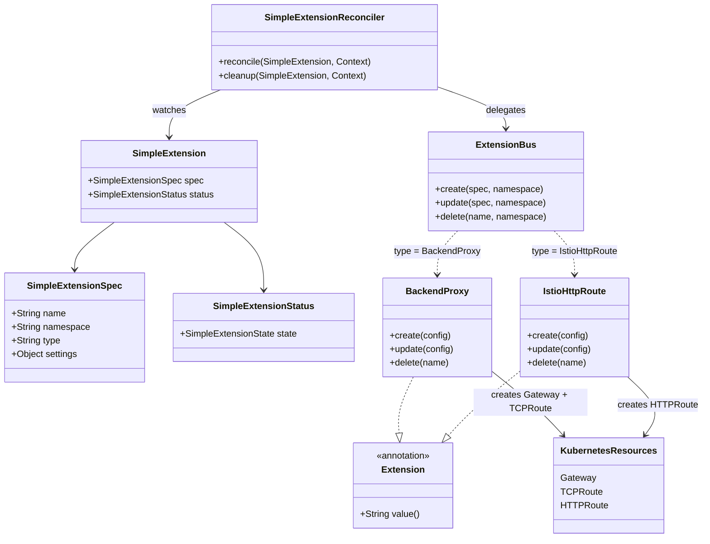
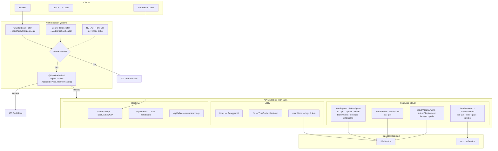
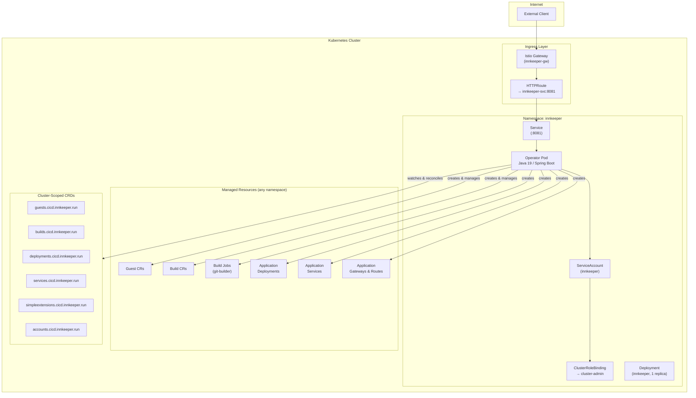

# InnKeeper — Project Definition

## Table of Contents

- [Overview](#overview)
- [Description](#description)
- [Core Concepts](#core-concepts)
- [Architecture Breakdown](#architecture-breakdown)
  - [1. High-Level System Architecture](#1-high-level-system-architecture)
  - [2. Custom Resource Lifecycle State Machines](#2-custom-resource-lifecycle-state-machines)
  - [3. Event-Driven Architecture](#3-event-driven-architecture)
  - [4. Guest Reconciliation Sequence](#4-guest-reconciliation-sequence)
  - [5. Build Pipeline Flow](#5-build-pipeline-flow)
  - [6. Extension Framework Class Diagram](#6-extension-framework-class-diagram)
  - [7. REST API and Security Layer](#7-rest-api-and-security-layer)
  - [8. Kubernetes Deployment Topology](#8-kubernetes-deployment-topology)
- [Technology Stack](#technology-stack)
- [Project Structure](#project-structure)

---

## Overview

**InnKeeper** is a Kubernetes-native CI/CD operator written in Java. It automates the full application lifecycle inside a Kubernetes cluster — building container images from Git sources, creating Deployments, exposing Services, and configuring ingress routing — all driven by declarative Custom Resource Definitions (CRDs).

The operator is built on the **Java Operator SDK (JOSDK)** for reconciliation loops and **Spring Boot** for its REST API surface.

---

## Description

InnKeeper acts as an "innkeeper" for applications running in a Kubernetes cluster. A user declares their desired state through a single **Guest** custom resource, which describes:

- **What to build** — Git repository URL, branch, Dockerfile path, and container registry push targets
- **What to deploy** — Container images, replica counts, resource limits, and volume mounts
- **What to expose** — Kubernetes Service ports, protocols, and selectors
- **What to extend** — Istio HTTP routes, TCP backend proxies, and gateway configurations

The operator watches these custom resources and continuously reconciles declared state against actual cluster state, creating, updating, or removing Kubernetes-native resources (Jobs, Deployments, Services, Gateways) as needed.

### Key Capabilities

| Capability | Description |
|---|---|
| **Automated Builds** | Monitors Git repositories for changes and triggers container image builds via Kubernetes Jobs using a dedicated builder image |
| **Deployment Management** | Creates and patches Kubernetes Deployments with configurable containers, replicas, image pull secrets, and volumes |
| **Service Exposure** | Generates Kubernetes Services with configurable port mappings and selectors |
| **Extension Framework** | Pluggable architecture supporting Istio HTTP routing, TCP backend proxies, and custom gateway management |
| **REST API** | Full CRUD API with OAuth2 (Google) and Bearer token authentication, Swagger documentation, and WebSocket support |
| **Account Management** | Role-based access control with a hierarchical permission tree model stored as Kubernetes custom resources |
| **Self-Bootstrapping** | Automatically registers its own CRDs on startup if they do not already exist in the cluster |

---

## Core Concepts

All custom resources belong to the API group `cicd.innkeeper.run/v1`.

| Resource | Description |
|---|---|
| **Guest** | Top-level orchestration resource. Declares the builds, deployments, services, and extensions for a single application. The GuestReconciler coordinates all child resources. |
| **Build** | Represents a container image build from a Git source. Managed as a Kubernetes Job using the `git-builder` image. Tracks state through a multi-step state machine. |
| **Deployment** | Represents a Kubernetes Deployment. Spec includes containers (with references to Build names), replicas, and volumes. |
| **Service** | Represents a Kubernetes Service with port definitions and a deployment selector. |
| **SimpleExtension** | Represents a pluggable extension. The `type` field routes to a specific handler (e.g., `BackendProxy`, `IstioHttpRoute`). |
| **Account** | Represents a user account with an email and a set of permissions. The first user to authenticate becomes the admin. |

---

## Architecture Breakdown

### 1. High-Level System Architecture

This diagram shows the four major layers of the system and how data flows between them.



---

### 2. Custom Resource Lifecycle State Machines

Each custom resource follows a state machine that the corresponding reconciler drives forward on every reconciliation cycle.



---

### 3. Event-Driven Architecture

The EventBus is a reflection-based dispatcher. On startup it scans the `run.innkeeper.controllers` package for methods annotated with `@Trigger(EventClass.class)` and builds a dispatch table. When a reconciler fires an event, the bus routes it to all matching handlers.



**Event Hierarchy:**

```mermaid
classDiagram
    class Event {
        <<abstract>>
    }
    class GuestEvent {
        +Guest guest
    }
    class BuildEvent {
        +Build build
    }
    class DeploymentEvent {
        +Deployment deployment
    }
    class ServiceEvent {
        +Service service
    }
    class ExtensionEvent {
        +SimpleExtension extension
    }

    Event <|-- GuestEvent
    Event <|-- BuildEvent
    Event <|-- DeploymentEvent
    Event <|-- ServiceEvent
    Event <|-- ExtensionEvent
    Event <|-- ServerStarted

    GuestEvent <|-- CheckGuestBuildChanges
    GuestEvent <|-- CheckGuestDeploymentChanges
    GuestEvent <|-- CheckGuestServiceChanges
    GuestEvent <|-- CheckGuestExtensionChanges
    GuestEvent <|-- DeleteGuestBuild
    GuestEvent <|-- DeleteGuestDeployment
    GuestEvent <|-- DeleteGuestService

    BuildEvent <|-- StartBuild
    BuildEvent <|-- MonitorBuild
    BuildEvent <|-- MonitorGit
    BuildEvent <|-- CheckGitBuild
    BuildEvent <|-- FailedBuild
    BuildEvent <|-- BuildFinished
    BuildEvent <|-- UpdateBuild

    DeploymentEvent <|-- CreateDeployment
    DeploymentEvent <|-- UpdateDeployment
    DeploymentEvent <|-- CheckDeployment

    ServiceEvent <|-- CreateService
    ServiceEvent <|-- UpdateService
```



---

### 4. Guest Reconciliation Sequence

This diagram shows the end-to-end flow when a user creates a Guest resource.



---

### 5. Build Pipeline Flow

This diagram details how a Build resource progresses from Git check to published container image.



**Environment variables injected into build Jobs:**

| Variable | Source |
|---|---|
| `GIT_URL` | BuildSettings.git.uri |
| `GIT_BRANCH` | BuildSettings.git.branch |
| `DOCKER_FILE` | BuildSettings.docker.file |
| `DOCKER_WORKDIR` | BuildSettings.docker.workdir |
| `PUBLISH_REGISTRY` | BuildSettings.publish.registry |
| `PUBLISH_TAG` | BuildSettings.publish.tag |

---

### 6. Extension Framework Class Diagram

The extension framework uses an `@Extension` annotation to mark pluggable handlers. The `ExtensionBus` discovers them via reflection and routes based on the `type` field in the `SimpleExtensionSpec`.



---

### 7. REST API and Security Layer

This diagram shows the authentication pipeline and how requests reach the operator layer.



**Permission Model:**
- Permissions are stored in the `Account` CRD spec as a list of strings (e.g., `guest.build.list`, `user.**`)
- The `PermissionTree` class implements hierarchical matching — `**` acts as a wildcard granting all sub-permissions
- The first user to log in is automatically granted admin (`**`) permissions
- The `CheckUserAuthorized` Spring AOP aspect intercepts every `@UserAuthorized` method call and validates permissions before execution

---

### 8. Kubernetes Deployment Topology

This diagram shows how the operator itself is deployed and what cluster resources it manages.



The operator requires `cluster-admin` privileges because it manages CRDs, Jobs, Deployments, Services, and Gateway API resources across all namespaces.

---

## Technology Stack

| Layer | Technology | Version |
|---|---|---|
| **Language** | Java | 19 |
| **Build System** | Gradle | Groovy DSL |
| **Operator Framework** | Java Operator SDK (JOSDK) | 4.2.8 |
| **Kubernetes Client** | Fabric8 | 6.7.1 |
| **Web Framework** | Spring Boot | 3.0.6 |
| **Security** | Spring Security + OAuth2 (Google) | 6.1.0 |
| **API Documentation** | SpringDoc OpenAPI / Swagger UI | 2.0.4 |
| **Service Mesh** | Istio Client | 1.7.7.1 |
| **CRD Generation** | Fabric8 CRD Generator APT | 6.5.1 |
| **Container Runtime** | Docker (OpenJDK 19 on OracleLinux 8) | — |
| **CI/CD** | GitHub Actions | — |
| **Container Registry** | GitHub Container Registry (GHCR) | — |
| **Testing** | JUnit | 5.9.2 |

---

## Project Structure

```
java-operator/
├── src/main/java/run/innkeeper/
│   ├── Main.java                        # Entry point — registers CRDs, boots EventBus
│   ├── api/                             # REST API layer
│   │   ├── annotations/                 #   @UserAuthorized, @WebSocketUserAuthorized
│   │   ├── config/                      #   Security, WebSocket, Swagger config
│   │   ├── dto/                         #   API response DTOs
│   │   ├── endpoints/                   #   REST controllers (Guest, Build, Deploy, etc.)
│   │   └── services/                    #   WebSocket session storage
│   ├── v1/                              # CRD definitions + Reconcilers
│   │   ├── guest/                       #   Guest CRD, spec, status, reconciler
│   │   ├── build/                       #   Build CRD, spec, status, reconciler
│   │   ├── deployment/                  #   Deployment CRD, spec, status, reconciler
│   │   ├── service/                     #   Service CRD, spec, status, reconciler
│   │   ├── simpleExtensions/            #   SimpleExtension CRD, spec, status, reconciler
│   │   └── account/                     #   Account CRD, spec, status, reconciler
│   ├── buses/                           # Service buses — Kubernetes resource managers
│   │   ├── EventBus.java               #   Reflection-based event dispatcher
│   │   ├── BuildBus.java               #   Build job orchestration (extends JobBus)
│   │   ├── GitBus.java                 #   Git change detection (extends JobBus)
│   │   ├── JobBus.java                 #   Abstract Kubernetes Job manager
│   │   ├── DeploymentBus.java          #   K8s Deployment CRUD
│   │   ├── ServiceBus.java             #   K8s Service CRUD
│   │   └── ExtensionBus.java           #   Extension routing
│   ├── controllers/                     # Event handlers (annotated with @Trigger)
│   │   ├── BuildController.java
│   │   ├── DeploymentController.java
│   │   ├── GuestController.java
│   │   ├── ServiceController.java
│   │   └── SimpleExtensionController.java
│   ├── events/                          # Event class definitions
│   │   ├── structure/                   #   Base classes, @Trigger annotation
│   │   ├── actions/                     #   Action events (StartBuild, CreateDeployment, etc.)
│   │   └── builds/, deployments/, ...   #   Domain-specific events
│   ├── extensions/                      # Extension implementations
│   │   └── gateway/                     #   BackendProxy, IstioHttpRoute
│   ├── services/                        # Core singletons
│   │   ├── K8sService.java             #   Kubernetes client wrapper
│   │   └── AccountService.java         #   User + permission management
│   ├── permission/                      # Permission tree model
│   └── utilities/                       # Logging, hashing, build monitoring
├── src/main/resources/
│   ├── application.yaml                 # Spring Boot config (port, OAuth2, Swagger)
│   └── logback.xml                      # Logging config
├── build.gradle                         # Gradle build script
├── Dockerfile                           # Multi-stage Docker build
├── testfiles/
│   ├── innkeeper.yaml                   # Example Guest resource
│   └── operator.yml                     # K8s deployment manifest for the operator
└── .github/workflows/
    └── docker-image.yml                 # CI — build & push to GHCR
```
